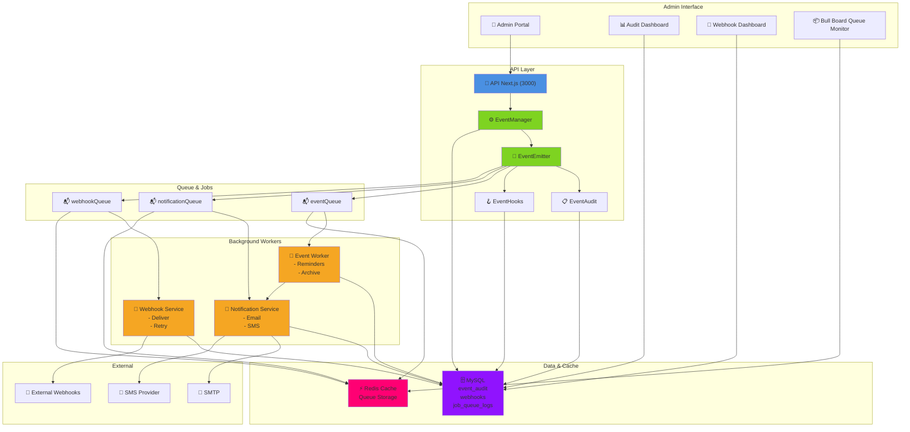
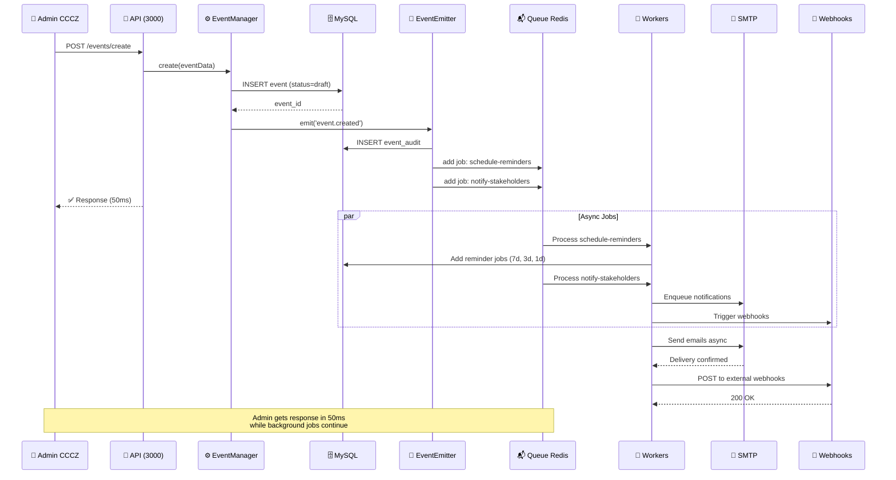
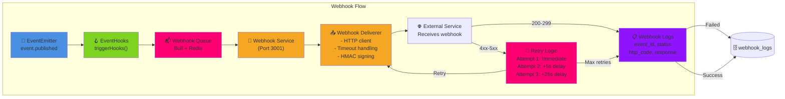
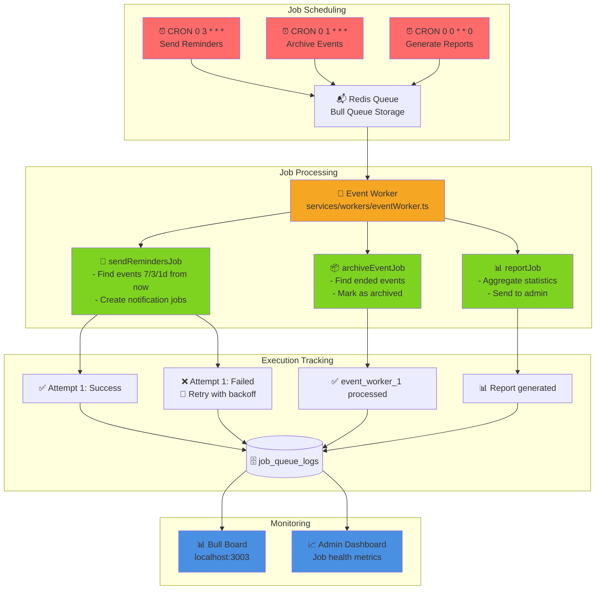
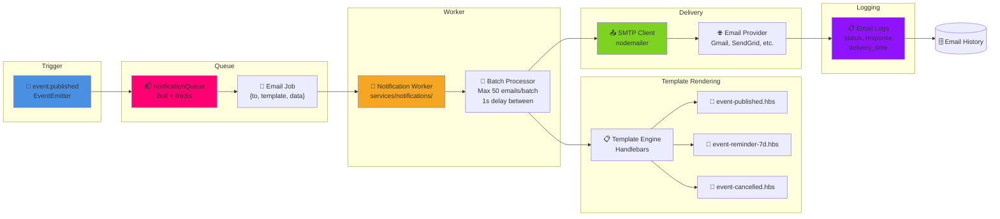
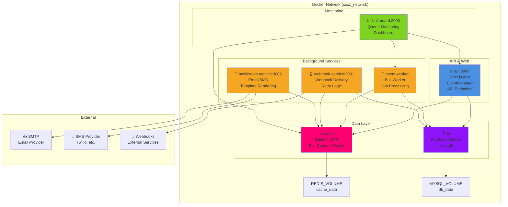
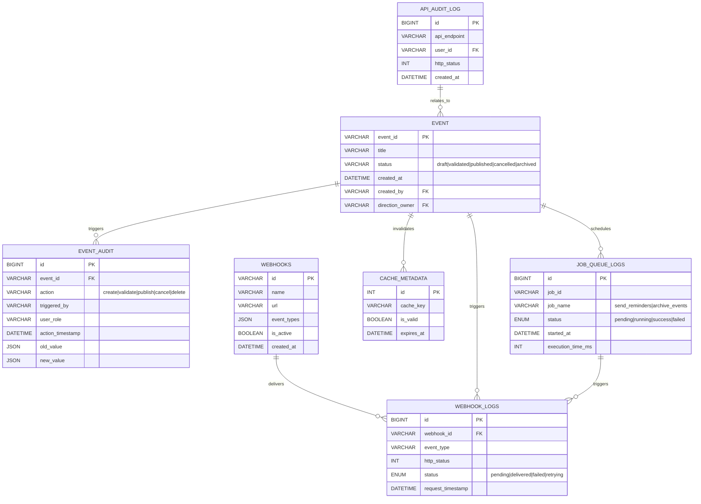

# 📊 Diagrammes d'Architecture - Système d'Événements CCCZ

## 1. Vue d'ensemble de la nouvelle architecture



---

## 2. Flux de création d'événement (Publication)



---

## 3. Cycle de validation d'événement

```mermaid
state "Event Lifecycle" as EL {
    
    [*] --> DRAFT: Admin creates
    
    DRAFT: status=draft<br/>created_at=now<br/>created_by=user_id
    
    DRAFT --> VALIDATED: ROLE_DACPA validates
    
    VALIDATED: validated_at=now<br/>validated_by=user_id<br/>Audit logged
    
    VALIDATED --> PUBLISHED: ROLE_DG approves
    
    PUBLISHED: published_at=now<br/>posted_by=user_id<br/>Webhooks triggered<br/>Notifications sent<br/>Cache invalidated
    
    VALIDATED --> DRAFT: ROLE_DACPA rejects
    
    PUBLISHED --> CANCELLED: Admin cancels
    CANCELLED: cancelled_at=now<br/>Notifications sent<br/>Webhook triggered
    
    CANCELLED --> [*]
    PUBLISHED --> [*]: Auto-archived<br/>after end_date
    
    state PUBLISHED {
        [*] --> ACTIVE: Event ongoing
        ACTIVE --> ENDED: After end_date
    }
}
```

---

## 4. Architecture de webhook et retry



---

## 5. Job Queue Architecture



---

## 6. Email Notification Pipeline



---

## 7. Docker Compose Services



---

## 8. Database Schema Relationships



---

## 9. Comparaison latence avant/après

```mermaid
gantt
    title API Response Time Comparison
    
    section Before (File-based)
    Parse JSON file :a1, 0, 50ms
    Validate event :a2, after a1, 30ms
    Write file :a3, after a2, 100ms
    Write history :a4, after a3, 50ms
    Total (BLOCKING) :crit, a1, 230ms
    
    section After (DB+Queue)
    DB Insert :b1, 0, 20ms
    Emit event :b2, after b1, 10ms
    Enqueue jobs :b3, after b2, 20ms
    Response :crit, b1, 50ms
    
    section Background (Async)
    Process jobs :c1, 50ms, 500ms
    Send webhooks :c2, 50ms, 800ms
    Send emails :c3, 50ms, 2000ms
```

---

## 10. Monitoring Dashboard Views

```mermaid
graph TB
    subgraph "Admin Dashboard (3000/admin)"
        D1["📊 Audit Timeline<br/>See all event changes"]
        D2["🪝 Webhook Health<br/>Success rate chart"]
        D3["📦 Job Monitor<br/>Queue status"]
        D4["🔍 Compliance Report<br/>GDPR audit trail"]
    end
    
    subgraph "Bull Board (3003)"
        BB1["Active Jobs"]
        BB2["Completed Jobs"]
        BB3["Failed Jobs"]
        BB4["Queue Performance"]
    end
    
    subgraph "Health Checks"
        HC1["GET /health"]
        HC2["GET /api/events/audit"]
        HC3["GET /api/webhooks/health"]
        HC4["GET /api/jobs/status"]
    end
    
    D1 --> DB[(🗄️ event_audit)]
    D2 --> DB
    D3 --> DB
    D4 --> DB
    
    BB1 --> REDIS[(⚡ Redis)]
    BB2 --> REDIS
    BB3 --> REDIS
    BB4 --> REDIS
    
    HC1 --> API
    HC2 --> DB
    HC3 --> DB
    HC4 --> DB
    
    style D1 fill:#4A90E2
    style D2 fill:#4A90E2
    style D3 fill:#4A90E2
    style D4 fill:#4A90E2
    style BB1 fill:#7ED321
    style BB2 fill:#7ED321
    style BB3 fill:#7ED321
    style BB4 fill:#7ED321
```



---

## Légende des icônes

| Icône | Signification |
|-------|---------------|
| 🚀 | API/Server |
| 🗄️ | Base de données |
| ⚡ | Cache/Redis |
| 📬 | Queue job |
| 👷 | Worker process |
| 📣 | Event emitter |
| 🪝 | Webhook |
| 📧 | Email/Notification |
| 📊 | Dashboard/Monitoring |
| 🔐 | Authentication |
| 🌐 | External service |
| ⏰ | Scheduler/Cron |
| 📋 | Logs/Audit |
| ✅ | Success |
| ❌ | Error/Failure |
| 🔄 | Retry/Loop |
